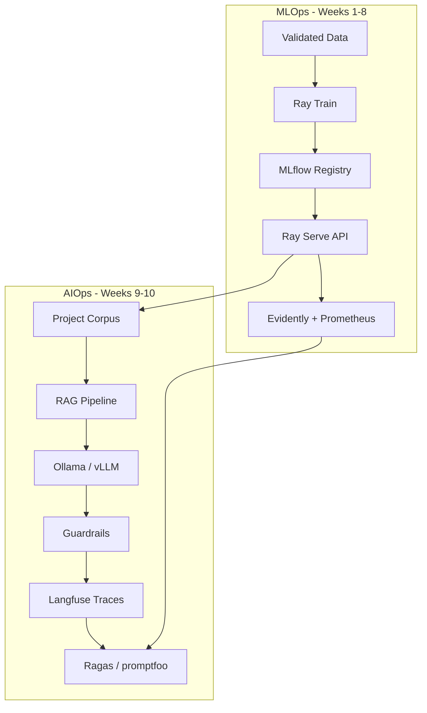

# AIOps Extension Track

The core course (Weeks 1–8) teaches **MLOps** — operating classical ML systems in production. The **AIOps extension** (Weeks 9–10) teaches **AI Operations** — running LLM-powered applications reliably at scale.

Both tracks use the same Made With ML project as the anchor, then extend it with a RAG assistant over your ML topic dataset.

## MLOps vs AIOps

| Dimension | MLOps (Weeks 1–8) | AIOps (Weeks 9–10) |
|-----------|-------------------|---------------------|
| Unit of deploy | Trained model weights | Model + prompts + retrieval index |
| Input | Structured features | Natural language, multimodal |
| Failure modes | Data drift, accuracy drop | Hallucination, prompt injection, cost spikes |
| Evaluation | Holdout metrics (F1, AUC) | LLM-as-judge, RAG faithfulness, safety tests |
| Versioning | Model registry | Prompts, embeddings, chunking strategy |
| Serving | Batch / real-time API | Streaming, token budgets, fallbacks |
| Monitoring | Prediction drift | Latency per token, retrieval quality, guardrail triggers |

## What you build in the AIOps track

1. **RAG assistant** — answer questions about ML projects using `datasets/projects.csv`
2. **Open source LLM serving** — Ollama locally or vLLM on GPU
3. **Prompt versioning** — tracked prompts in Git + MLflow
4. **LLM evaluation suite** — faithfulness, relevance, safety checks
5. **Guardrails** — input/output validation before responses reach users
6. **Observability** — traces, token usage, cost estimates per session

## Open source AIOps stack

| Layer | Tool | License |
|-------|------|---------|
| LLM runtime | [Ollama](https://ollama.com) | MIT |
| Embeddings | [sentence-transformers](https://www.sbert.net/) | Apache 2.0 |
| Vector store | [Chroma](https://www.trychroma.com/) | Apache 2.0 |
| RAG framework | [LlamaIndex](https://www.llamaindex.ai/) | MIT |
| LLM tracing | [Langfuse](https://langfuse.com/) (self-hosted) | MIT |
| LLM eval | [Ragas](https://docs.ragas.io/) | Apache 2.0 |
| Prompt testing | [promptfoo](https://www.promptfoo.dev/) | MIT |
| Guardrails | [guardrails-ai](https://github.com/guardrails-ai/guardrails) | Apache 2.0 |

All tools in `requirements-aiops.txt` are optional — install only for Weeks 9–10.

## Prerequisites for AIOps track

Complete Weeks 1–8 **or** demonstrate equivalent experience:

- [ ] Served an API with Ray Serve (Week 5)
- [ ] CI pipeline on your fork (Week 6)
- [ ] Understanding of MLflow experiment tracking (Week 3)

Hardware for AIOps:
- **Minimum**: 16 GB RAM, CPU-only Ollama with a small model (e.g. `llama3.2:1b`)
- **Recommended**: 16+ GB RAM + GPU for `llama3.2:3b` or larger

## Weekly modules

| Week | Guide | Focus |
|------|-------|-------|
| 9 | [week-09-aiops-rag-llm-serving.md](week-09-aiops-rag-llm-serving.md) | RAG pipeline, embeddings, LLM serving |
| 10 | [week-10-aiops-eval-guardrails-ops.md](week-10-aiops-eval-guardrails-ops.md) | Eval, guardrails, tracing, agent ops |

## Connection to the classifier

Your Week 5 classifier and Week 9 RAG assistant complement each other:

| Component | Classifier (MLOps) | RAG Assistant (AIOps) |
|-----------|-------------------|------------------------|
| Task | Predict topic tag | Answer natural language questions |
| Latency | ~50–200 ms | ~1–10 s (depends on model) |
| Explainability | Probability scores | Retrieved source chunks |
| Deploy together | Route `/predict` vs `/ask` on same FastAPI app |

## After Week 10

See [sessions/alumni-track.md](sessions/alumni-track.md) for ongoing projects and [sessions/roadmap.md](sessions/roadmap.md) for planned future sessions.
