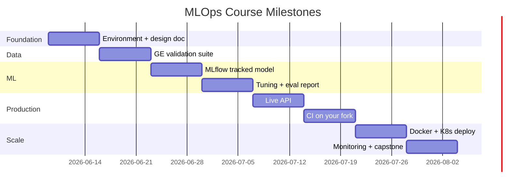

# 8-Week Schedule

Two months, eight modules. Each week assumes **10–15 hours** of study and hands-on work.

## Calendar at a glance

| Week | Dates (example) | Focus | Hours |
|------|-----------------|-------|-------|
| 1 | Jun 9 – Jun 15 | Foundations & setup | 10h |
| 2 | Jun 16 – Jun 22 | Data engineering | 12h |
| 3 | Jun 23 – Jun 29 | Modeling & training | 15h |
| 4 | Jun 30 – Jul 6 | Evaluation & tuning | 12h |
| 5 | Jul 7 – Jul 13 | Serving & APIs | 12h |
| 6 | Jul 14 – Jul 20 | Testing & CI/CD | 12h |
| 7 | Jul 21 – Jul 27 | Docker & Kubernetes | 15h |
| 8 | Jul 28 – Aug 3 | Monitoring & capstone | 15h |

Adjust start dates to your own calendar. The sequence matters more than the exact dates.

## Daily rhythm (suggested)

**Weekdays (2h/day × 5 = 10h)**

| Day | Activity |
|-----|----------|
| Mon | Read weekly guide + watch overview material |
| Tue | Lab 1 — explore notebook / scripts |
| Wed | Lab 2 — implement exercises |
| Thu | Lab 3 — tests and debugging |
| Fri | Deliverable + reflection notes |

**Weekend supplement (+2–5h)** for GPU training runs, CI setup, or capstone work.

## Milestone map

## Phase breakdown

### Phase 1: Build (Weeks 1–4)

Learn ML system design and implement the core ML loop — data → train → evaluate → track.

**Exit criteria:** A model registered in MLflow with documented metrics on a holdout set.

### Phase 2: Ship (Weeks 5–6)

Refactor to production code, serve predictions, and automate quality gates with CI/CD.

**Exit criteria:** A PR on your fork triggers training tests; merging deploys (or simulates deployment of) the service.

### Phase 3: Operate (Weeks 7–8)

Containerize, orchestrate on Kubernetes, add monitoring, and complete an independent capstone.

**Exit criteria:** Capstone demo with architecture diagram, live or recorded API demo, and monitoring snapshot.

## Flex pacing

| Pace | Adjustment |
|------|------------|
| **Full-time (20h/week)** | Combine weeks 1–2 and 5–6; start capstone in week 6 |
| **Part-time (5h/week)** | Stretch to 16 weeks — one module every two weeks |
| **Experienced MLE** | Skip week 1 readings; start at week 3; use capstone for a work project |

## Assessment (self-paced)

There are no grades. Use these rubrics to evaluate your own work:

| Deliverable | Good | Excellent |
|-------------|------|-----------|
| System design doc | Problem, data, metrics defined | Includes failure modes and SLAs |
| Data validation | Schema + null checks | Distribution tests + docs |
| MLflow experiment | Params and metrics logged | Artifacts versioned, compared across runs |
| API | Returns predictions via HTTP | Latency measured, error handling |
| CI pipeline | Tests pass on push | Train + eval results posted to PR |
| Capstone | Extends base project | Novel dataset, monitoring, and write-up |
