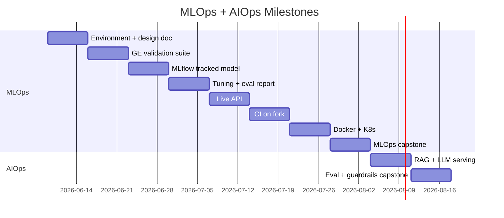

# 10-Week Schedule

**8 weeks MLOps** + **2 weeks AIOps**. Each week assumes **10–15 hours** of study and hands-on work. MLOps-only cohorts stop after Week 8 and may return later for Weeks 9–10.

## Calendar at a glance

| Week | Dates (example) | Focus | Hours |
|------|-----------------|-------|-------|
| 1 | Jun 9 – Jun 15 | Foundations & setup | 10h |
| 2 | Jun 16 – Jun 22 | Data engineering | 12h |
| 3 | Jun 23 – Jun 29 | Modeling & training | 15h |
| 4 | Jun 30 – Jul 6 | Evaluation & tuning | 12h |
| 5 | Jul 7 – Jul 13 | Serving & APIs | 12h |
| 6 | Jul 14 – Jul 20 | Testing & CI/CD | 12h |
| 7 | Jul 21 – Jul 27 | Docker & Kubernetes | 15h |
| 8 | Jul 28 – Aug 3 | Monitoring & MLOps capstone | 15h |
| 9 | Aug 4 – Aug 10 | AIOps: RAG & LLM serving | 12h |
| 10 | Aug 11 – Aug 17 | AIOps: Eval, guardrails & capstone | 15h |

Adjust dates to your calendar. Use [sessions/cohort-registry.md](sessions/cohort-registry.md) to log your cohort dates.

## Daily rhythm (suggested)

**Weekdays (2h/day × 5 = 10h)**

| Day | Activity |
|-----|----------|
| Mon | Read weekly guide + learning objectives |
| Tue | Lab 1 — explore notebook / scripts |
| Wed | **Live session** (90 min) — [session templates](sessions/session-templates.md) |
| Thu | Lab 2 — implement exercises / office hours |
| Fri | Deliverable + reflection notes |

**Weekend supplement (+2–5h)** for GPU runs, CI setup, or capstone work.

## Milestone map

## Phase breakdown

### Phase 1: Build (Weeks 1–4)

Learn ML system design and implement the core ML loop — data → train → evaluate → track.

**Exit criteria:** A model registered in MLflow with documented metrics on a holdout set.

### Phase 2: Ship (Weeks 5–6)

Refactor to production code, serve predictions, and automate quality gates with CI/CD.

**Exit criteria:** A PR on your fork triggers tests; merge path defined for deployment.

### Phase 3: Operate (Weeks 7–8)

Containerize, orchestrate on Kubernetes, add monitoring, and complete the MLOps capstone.

**Exit criteria:** MLOps capstone demo with architecture diagram and monitoring snapshot.

### Phase 4: AI Operations (Weeks 9–10)

Build a RAG assistant, evaluate LLM quality, add guardrails and tracing, deliver AIOps capstone.

**Exit criteria:** `/ask` API with eval scores, guardrails, and traces documented.

### Phase 5: Stay alive (ongoing)

Monthly [alumni sessions](sessions/alumni-track.md) and the next cohort — see [sessions/cohort-playbook.md](sessions/cohort-playbook.md).

## Flex pacing

| Pace | Adjustment |
|------|------------|
| **MLOps only (8 weeks)** | Stop after Week 8; schedule Weeks 9–10 as a follow-on cohort |
| **Full-time (20h/week)** | Combine weeks 1–2 and 5–6; start capstone in week 6 |
| **Part-time (5h/week)** | Stretch to 20 weeks — one module every two weeks |
| **AIOps only** | Prerequisites: complete Weeks 1–8 or equivalent; start at Week 9 |

## Assessment (self-paced)

| Deliverable | Good | Excellent |
|-------------|------|-----------|
| System design doc | Problem, data, metrics defined | Failure modes and SLAs |
| Data validation | Schema + null checks | Distribution tests + docs |
| MLflow experiment | Params and metrics logged | Artifacts versioned across runs |
| API | `/predict` returns via HTTP | Latency measured, error handling |
| CI pipeline | Tests pass on push | Eval results on PR |
| MLOps capstone | Extends base project | Novel dataset + monitoring |
| RAG assistant | Answers with sources | Traced + prompt versioned |
| AIOps capstone | Eval scores documented | CI eval gate + guardrails |
