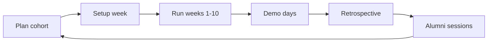

# Cohort Playbook

Operational checklist to launch, run, and sustain multiple course sessions without starting from scratch each time.

## Session lifecycle



## Phase 1: Plan (T-4 weeks)

| Task | Owner | Done |
|------|-------|------|
| Choose 8-week or 10-week format | Lead | ☐ |
| Set dates and session times | Lead | ☐ |
| [Register cohort](cohort-registry.md) | Lead | ☐ |
| Create Slack/Discord channel | TA | ☐ |
| Announce prerequisites | Lead | ☐ |
| Recruit TAs (1 per 15 learners) | Lead | ☐ |

## Phase 2: Setup (T-1 week)

| Task | Owner | Done |
|------|-------|------|
| Setup clinic session | TA | ☐ |
| Verify course docs link to `main` branch | Lead | ☐ |
| Test Docker Compose stack locally | TA | ☐ |
| For AIOps: test Ollama + `rag.py build-index` | TA | ☐ |
| Prepare kickoff invite with [Session 0 agenda](session-templates.md) | Lead | ☐ |

## Phase 3: Run (weekly)

Copy this checklist each week:

```markdown
## Week N checklist
- [ ] Post week guide link Monday
- [ ] Live session Wednesday (agenda from session-templates.md)
- [ ] Office hours Thursday
- [ ] Friday: deliverable reminder
- [ ] Log blockers in cohort FAQ
- [ ] TA notes for facilitator improvements
```

### Mid-cohort pulse (Week 4)

- Anonymous survey: pace, difficulty, blockers
- Adjust office hours if setup issues persist
- Identify learners at risk (no fork, no MLflow runs)

### Pre-AIOps gate (before Week 9)

Confirm learners have:
- [ ] Working `/predict` API from Week 5
- [ ] Ollama installed or Docker Compose path tested
- [ ] `pip install -r requirements-aiops.txt` succeeds

## Phase 4: Demo days

| Event | When | Prep |
|-------|------|------|
| MLOps Demo Day | End of Week 8 | Capstone rubric, timekeeper |
| AIOps Demo Day | End of Week 10 | Eval scores required in demo |

Record demos (with permission) for future cohort examples.

## Phase 5: Retrospective (within 1 week of end)

| Question | Capture in |
|----------|------------|
| What labs took too long? | CHANGELOG.md |
| What blockers repeated? | cohort FAQ |
| What should Week N change? | GitHub Issue |
| Alumni interest? | alumni-track signup |

## Phase 6: Keep alive (ongoing)

| Activity | Cadence | Doc |
|----------|---------|-----|
| Alumni sessions | Monthly | [alumni-track.md](alumni-track.md) |
| Content updates | Per cohort | [CHANGELOG.md](../CHANGELOG.md) |
| New topics planning | Quarterly | [roadmap.md](roadmap.md) |
| Next cohort announcement | When retro done | [cohort-registry.md](cohort-registry.md) |

## Handoff between facilitators

When a new facilitator takes over:

1. Read [facilitator-guide.md](facilitator-guide.md)
2. Review last cohort row in [cohort-registry.md](cohort-registry.md)
3. Read latest [CHANGELOG.md](../CHANGELOG.md)
4. Skim open `cohort-feedback` GitHub Issues
5. Run setup clinic dry run on a fresh machine

## Learner communication templates

### Week start (Monday)

```
Week N: [Title] is live!
📖 Guide: docs/course/week-0N-....md
🎯 Deliverable: [one line]
💬 Office hours: [time]
```

### Week end (Friday)

```
Week N deliverable check:
☐ [item 1]
☐ [item 2]
Share wins in #showcase — even small ones count!
```

### Alumni invite (post Week 10)

```
You finished MLOps + AIOps! 🎉
Join monthly alumni sessions: docs/course/sessions/alumni-track.md
Next topic: [from roadmap]
```
