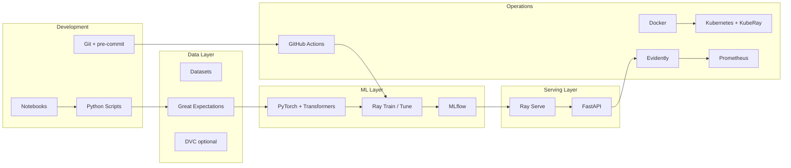

# Open Source Tech Stack

Every tool in this course is open source and can run locally, on a single VM, or on Kubernetes. No paid licenses required.

## Architecture overview



## Core stack (required)

| Layer | Tool | Role in this course | Repo usage |
|-------|------|---------------------|------------|
| Language | Python 3.10 | All workloads | Entire codebase |
| Compute | [Ray](https://ray.io) | Distributed data, train, tune, serve | `madewithml/train.py`, `tune.py`, `serve.py` |
| Deep learning | [PyTorch](https://pytorch.org) + [Transformers](https://huggingface.co/docs/transformers) | Text classification model | `madewithml/models.py` |
| Tracking | [MLflow](https://mlflow.org) | Experiments, artifacts, model registry | `madewithml/config.py`, training scripts |
| Serving | [Ray Serve](https://docs.ray.io/en/latest/serve/) + [FastAPI](https://fastapi.tiangolo.com) | Production inference API | `madewithml/serve.py` |
| CLI | [Typer](https://typer.tiangolo.com) | Script interfaces | All `madewithml/*.py` entry points |
| Testing | [pytest](https://pytest.org) | Code, data, model tests | `tests/` |
| Data quality | [Great Expectations](https://greatexpectations.io) | Schema and distribution checks | Week 2 exercises |
| Linting | [black](https://black.readthedocs.io), [isort](https://pycqa.github.io/isort/), [flake8](https://flake8.pycqa.org) | Code style | `pyproject.toml`, pre-commit |
| CI/CD | [GitHub Actions](https://github.com/features/actions) | Automated train + deploy | `.github/workflows/` |
| Containers | [Docker](https://www.docker.com) | Reproducible environments | Week 7 |
| Orchestration | [Kubernetes](https://kubernetes.io) + [KubeRay](https://docs.ray.io/en/latest/cluster/kubernetes/index.html) | Production cluster | Week 7 |

## Supporting libraries (included in repo)

| Tool | Purpose |
|------|---------|
| Hyperopt | Search algorithms for Ray Tune |
| Snorkel | Weak supervision / programmatic labeling |
| cleanlab | Label noise detection (notebook) |
| NLTK | Text preprocessing |
| scikit-learn | Metrics and utilities |
| pandas / numpy | Data manipulation |

## Optional extensions (Week 7–8)

| Tool | Purpose | When to add |
|------|---------|-------------|
| [DVC](https://dvc.org) | Data and model versioning | Large datasets or team collaboration |
| [Feast](https://feast.dev) | Feature store | Multiple models sharing features |
| [Prefect](https://www.prefect.io) or [Airflow](https://airflow.apache.org) | Workflow orchestration | Scheduled retraining pipelines |
| [Evidently](https://www.evidentlyai.com) | Data drift and model monitoring | Post-deployment observability |
| [Prometheus](https://prometheus.io) + [Grafana](https://grafana.com) | Metrics dashboards | Production monitoring |
| [MinIO](https://min.io) | S3-compatible object storage | Self-hosted artifact store |

## Replacing managed services

The original Made With ML deployment path uses Anyscale for jobs and services. This course teaches equivalent open source paths:

| Managed (original course) | Open source alternative |
|---------------------------|-------------------------|
| Anyscale Workspaces | Local Ray cluster or JupyterLab |
| Anyscale Jobs | `ray job submit` or GitHub Actions + Ray |
| Anyscale Services | Ray Serve on K8s (KubeRay) |
| S3 (AWS) | MinIO or local filesystem |
| Anyscale cluster env | Docker image + `requirements.txt` |

You can still follow the Anyscale path from the main README if you have access — the concepts are identical.

## Minimum hardware

| Workload | Local laptop | Cloud VM (recommended for Week 3+) |
|----------|--------------|-------------------------------------|
| Data + tests | 4 CPU, 8 GB RAM | — |
| Training (1 GPU epoch) | CPU only (slow) | 1× T4 or better, 16 GB RAM |
| Tuning (2–5 trials) | CPU, expect hours | 1–2 GPUs |
| Serving | 2 CPU, 4 GB RAM | 2 CPU, 8 GB RAM |

Free GPU options: Google Colab (notebook only), Kaggle kernels, or a cloud free tier VM.

## Environment setup (one command reference)

```bash
python3 -m venv venv && source venv/bin/activate
pip install -r requirements.txt
pre-commit install
export PYTHONPATH=$PYTHONPATH:$PWD

# Start MLflow UI
mlflow server -h 0.0.0.0 -p 8080 --backend-store-uri ./mlruns

# Start Ray (local)
ray start --head
```
