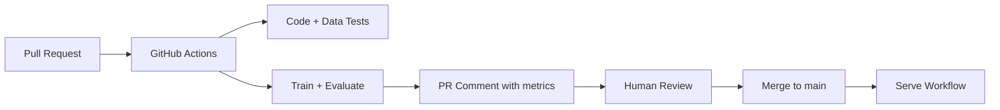

# Week 6: Testing & CI/CD

**Goal:** Build confidence in every change with automated tests and continuous integration that trains on PRs and deploys on merge.

**Time:** ~12 hours

## Learning objectives

- Run the three test layers: code, data, model
- Configure pre-commit hooks for code quality
- Fork the repo and set up GitHub Actions CI
- Understand the PR → train → comment → merge → deploy flow

## Readings (2h)

1. `tests/code/` — unit tests for all modules
2. `tests/data/` — dataset validation tests
3. `tests/model/` — behavioral and performance tests
4. `.github/workflows/workloads.yaml` — PR training workflow
5. `.github/workflows/serve.yaml` — production deploy workflow
6. `.pre-commit-config.yaml` — local quality gates

## Key concepts

### Testing pyramid for ML

```
        ┌─────────────┐
        │  Model tests │  behavioral, performance floors
        ├─────────────┤
        │  Data tests  │  schema, distributions
        ├─────────────┤
        │  Code tests  │  unit tests, coverage
        └─────────────┘
```

### CI/CD for ML

Traditional CI runs tests. **MLOps CI** also:
- Trains/evaluates on PR data
- Posts metrics as PR comments
- Deploys only after human approval + passing gates



## Lab 1: Run all tests (2h)

```bash
# Code tests
python3 -m pytest tests/code --verbose --disable-warnings

# Data tests
export DATASET_LOC="datasets/dataset.csv"
pytest tests/data --verbose --disable-warnings

# Model tests (requires a trained run)
export EXPERIMENT_NAME="week4-tuning"
export RUN_ID=$(python madewithml/predict.py get-best-run-id \
    --experiment-name $EXPERIMENT_NAME --metric val_loss --mode ASC)
pytest --run-id=$RUN_ID tests/model --verbose --disable-warnings

# Coverage
python3 -m pytest tests/code --cov madewithml --cov-report term --disable-warnings
```

Target: understand what each test file guards against.

## Lab 2: Pre-commit hooks (1h)

```bash
pre-commit run --all-files
```

Fix any formatting issues (black, isort, flake8). These hooks run automatically on `git commit`.

## Lab 3: Fork and branch workflow (2h)

```bash
# On your fork
git remote set-url origin https://github.com/YOUR_USERNAME/Made-With-ML.git
git checkout -b feature/week6-ci-test
```

Make a small, safe change (e.g. add a test or update a docstring), commit, and push.

## Lab 4: Open source CI adaptation (4h)

The existing workflows use Anyscale and AWS. For an **open source CI path**, create `.github/workflows/ci-opensource.yaml` on your fork:

```yaml
name: ci-opensource
on:
  pull_request:
    branches: [main]
  push:
    branches: [main]

jobs:
  test:
    runs-on: ubuntu-latest
    steps:
      - uses: actions/checkout@v4
      - uses: actions/setup-python@v5
        with:
          python-version: "3.10"
          cache: pip
      - run: pip install -r requirements.txt
      - run: python3 -m pytest tests/code --verbose --disable-warnings
      - run: pytest tests/data --dataset-loc=datasets/dataset.csv --verbose --disable-warnings
```

Extend with a `train-smoke` job that runs 1 epoch on CPU (optional, slower).

For the full Anyscale CI/CD path, add secrets to your fork:
- `ANYSCALE_HOST`
- `ANYSCALE_CLI_TOKEN`

See [README CI/CD section](../../README.md).

## Lab 5: PR workflow simulation (3h)

Even without Anyscale, simulate the flow:

1. Create PR from `feature/week6-ci-test` → `main`
2. Verify `ci-opensource` workflow passes
3. Review what the full `workloads.yaml` would add (training results as PR comments)
4. Document the gap between your open source CI and full MLOps CI

## Exercise: Quality gate policy

Write `docs/my-project/quality-gates.md`:

```markdown
# Quality Gates

## PR merge requirements
- [ ] All code tests pass
- [ ] Data validation passes
- [ ] Coverage ≥ X%
- [ ] Holdout F1 ≥ previous best (or within 2%)

## Deploy requirements
- [ ] Merged to main
- [ ] Model run_id pinned in deploy config
- [ ] Smoke test on /predict returns 200
```

## Deliverable

- [ ] All three test suites passing locally
- [ ] Pre-commit hooks clean
- [ ] Open source CI workflow on your fork (green)
- [ ] Quality gates document committed

## Next week

[Week 7: Orchestration & Infrastructure](week-07-orchestration.md) — Docker, Kubernetes, and KubeRay.
