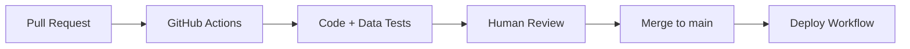

# Week 6: Testing & CI/CD

**Goal:** Build confidence in every change with automated tests and continuous integration.

**Time:** ~12 hours

## Learning objectives

- Run the three test layers: code, data, model
- Configure pre-commit hooks for code quality
- Fork the repo and set up GitHub Actions CI
- Understand the PR → test → merge flow

## Readings (2h)

1. `tests/code/` — unit tests for all modules
2. `tests/data/` — dataset validation tests
3. `tests/model/` — behavioral and performance tests
4. `.github/workflows/ci-opensource.yaml` — CI workflow
5. `.pre-commit-config.yaml` — local quality gates

## Key concepts

### Testing pyramid for ML

```
        ┌─────────────┐
        │  Model tests │  behavioral, performance floors
        ├─────────────┤
        │  Data tests  │  schema, distributions
        ├─────────────┤
        │  Code tests  │  unit tests, coverage
        └─────────────┘
```

### CI/CD for ML

Traditional CI runs tests. **MLOps CI** also:
- Runs data validation on every change
- Optionally runs smoke training on PRs
- Deploys only after human approval + passing gates



## Lab 1: Run all tests (2h)

```bash
# Code tests
python3 -m pytest tests/code --verbose --disable-warnings

# Data tests
export DATASET_LOC="datasets/dataset.csv"
pytest tests/data --verbose --disable-warnings

# Model tests (requires a trained run)
export EXPERIMENT_NAME="week4-tuning"
export RUN_ID=$(python ai_ml_ops/predict.py get-best-run-id \
    --experiment-name $EXPERIMENT_NAME --metric val_loss --mode ASC)
pytest --run-id=$RUN_ID tests/model --verbose --disable-warnings

# AIOps guard tests
python3 -m pytest tests/aiops --verbose --disable-warnings

# Coverage
python3 -m pytest tests/code --cov ai_ml_ops --cov-report term --disable-warnings
```

## Lab 2: Pre-commit hooks (1h)

```bash
pre-commit run --all-files
```

## Lab 3: Fork and branch workflow (2h)

```bash
git remote set-url origin https://github.com/YOUR_USERNAME/AI_ML_Ops.git
git checkout -b feature/week6-ci-test
```

Make a small change, commit, and push.

## Lab 4: CI on your fork (4h)

This repo includes [`.github/workflows/ci-opensource.yaml`](../../.github/workflows/ci-opensource.yaml). On your fork:

1. Push a branch and open a PR to `main`
2. Verify the workflow passes
3. Optional: add a `train-smoke` job that runs 1 epoch on CPU

Extend the workflow:

```yaml
  aiops:
    runs-on: ubuntu-latest
    steps:
      - uses: actions/checkout@v4
      - uses: actions/setup-python@v5
        with:
          python-version: "3.10"
      - run: pip install -r requirements.txt
      - run: python3 -m pytest tests/aiops --verbose --disable-warnings
```

## Lab 5: PR workflow (3h)

1. Create PR from `feature/week6-ci-test` → `main`
2. Verify CI passes
3. Document your quality gates in `docs/my-project/quality-gates.md`

## Exercise: Quality gate policy

Write `docs/my-project/quality-gates.md` with merge and deploy requirements.

## Deliverable

- [ ] All test suites passing locally
- [ ] Pre-commit hooks clean
- [ ] CI workflow green on your fork
- [ ] Quality gates document committed

## Next week

[Week 7: Orchestration & Infrastructure](week-07-orchestration.md)
