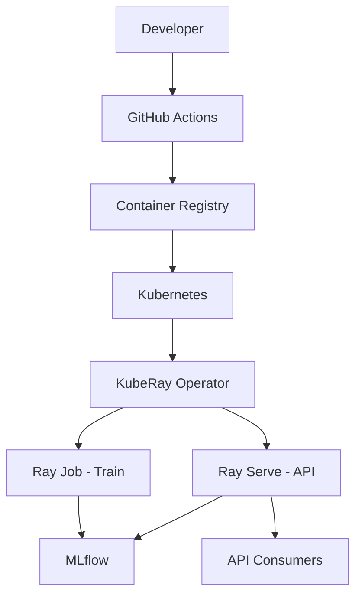

# Week 7: Orchestration & Infrastructure

**Goal:** Package your ML application in containers and deploy it on Kubernetes using open source orchestration tools.

**Time:** ~15 hours

## Learning objectives

- Containerize the training and serving workloads with Docker
- Understand Kubernetes primitives (Pod, Deployment, Service)
- Deploy Ray workloads with KubeRay
- Map cluster environments to container images

## Readings (2h)

1. `deploy/Dockerfile` — container image for training and serving
2. `deploy/docker-compose.yaml` — local MLflow, Ollama, Langfuse stack
3. `deploy/k8s/ray-cluster.yaml` — KubeRay cluster manifest
4. [KubeRay — Getting Started](https://docs.ray.io/en/latest/cluster/kubernetes/getting-started.html)
5. [Docker — Python guide](https://docs.docker.com/language/python/)

## Key concepts

### Infrastructure layers

| Layer | Tool | What it solves |
|-------|------|----------------|
| Dependencies | `requirements.txt` / Dockerfile | Reproducible env |
| Workloads | Ray Jobs | Batch train/tune/eval |
| Services | Ray Serve on K8s | Long-running API |
| Orchestration | KubeRay operator | Manage Ray clusters |
| Scheduling | Kubernetes | Resource allocation |

### Dockerfile structure

`deploy/Dockerfile` defines pip packages and application code:

```dockerfile
FROM python:3.10-slim
WORKDIR /app
COPY requirements.txt .
RUN pip install --no-cache-dir -r requirements.txt
COPY . .
ENV PYTHONPATH=/app
```

## Lab 1: Build the Dockerfile (3h)

Review and build `deploy/Dockerfile`:

```dockerfile
FROM python:3.10-slim

WORKDIR /app

RUN apt-get update && apt-get install -y --no-install-recommends \
    build-essential && rm -rf /var/lib/apt/lists/*

COPY requirements.txt .
RUN pip install --no-cache-dir -r requirements.txt

COPY ai_ml_ops/ ai_ml_ops/
COPY deploy/ deploy/
COPY datasets/ datasets/

ENV PYTHONPATH=/app

EXPOSE 8000
CMD ["python", "ai_ml_ops/serve.py", "--run_id", "REPLACE_AT_DEPLOY"]
```

Build and test:

```bash
docker build -f deploy/Dockerfile -t ai-ml-ops-serve:latest .
# Run requires a valid run_id baked in or passed via env
```

## Lab 2: Docker Compose for local stack (3h)

Create `deploy/docker-compose.yaml`:

```yaml
services:
  mlflow:
    image: ghcr.io/mlflow/mlflow:v2.3.1
    command: mlflow server --host 0.0.0.0 --port 5000 --backend-store-uri /mlruns
    volumes:
      - ./mlruns:/mlruns
    ports:
      - "5000:5000"

  # Add ray-head + serve after training locally and logging to ./mlruns
```

Bring up MLflow:

```bash
docker compose -f deploy/docker-compose.yaml up mlflow
```

## Lab 3: Kubernetes basics (4h)

If you have access to a cluster (minikube, kind, cloud free tier):

```bash
# Install KubeRay operator (see KubeRay docs for your K8s version)
helm repo add kuberay https://ray-project.github.io/kuberay-helm/
helm install kuberay-operator kuberay/kuberay-operator

# Deploy a RayCluster
kubectl apply -f deploy/k8s/ray-cluster.yaml  # create this in your fork
```

Minimal `deploy/k8s/ray-cluster.yaml` template:

```yaml
apiVersion: ray.io/v1
kind: RayCluster
metadata:
  name: ai-ml-ops-cluster
spec:
  rayVersion: "2.7.0"
  headGroupSpec:
    rayStartParams:
      dashboard-host: "0.0.0.0"
    template:
      spec:
        containers:
          - name: ray-head
            image: ai-ml-ops-serve:latest
            resources:
              limits:
                cpu: "2"
                memory: "4Gi"
```

## Lab 4: Batch job orchestration (3h)

Submit training as a Ray Job (local cluster):

```bash
ray job submit --working-dir . -- \
  python ai_ml_ops/train.py \
    --experiment-name batch-run \
    --dataset-loc datasets/dataset.csv \
    --train-loop-config '{"dropout_p": 0.5, "lr": 1e-4, "lr_factor": 0.8, "lr_patience": 3}' \
    --num-workers 1 --cpu-per-worker 2 --gpu-per-worker 0 \
    --num-epochs 3 --batch-size 64 \
    --results-fp results/batch_training.json
```

For Kubernetes, mount a persistent volume for MLflow artifacts. Document your approach in `docs/my-project/infra.md`.

## Exercise: Architecture diagram

Update your Week 1 system design with the production infrastructure:



## Deliverable

- [ ] Dockerfile builds successfully
- [ ] Docker Compose runs MLflow locally
- [ ] K8s manifests drafted (even if not deployed)
- [ ] Infrastructure doc with open source storage plan

## No Kubernetes?

Use these alternatives and note them in your infra doc:
- **minikube** — local single-node K8s
- **kind** — K8s in Docker
- **Ray local** — `ray job submit` without K8s (valid for learning)

## Next week

[Week 8: Monitoring & Capstone](week-08-monitoring-capstone.md) — observe production behavior and ship your final project.
