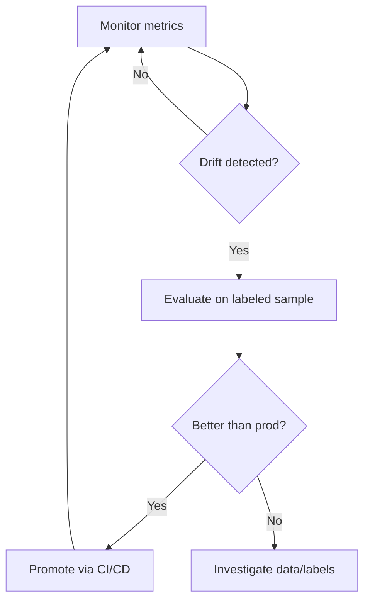

# Week 8: Monitoring & Capstone

**Goal:** Add observability to your ML system and deliver a capstone project that demonstrates end-to-end MLOps competence.

**Time:** ~15 hours

## Learning objectives

- Detect data and model drift with Evidently
- Expose service metrics with Prometheus-compatible endpoints
- Design a retraining trigger policy
- Complete and present an independent capstone extension

## Readings (2h)

1. [Evidently — Drift detection](https://docs.evidentlyai.com/)
2. [MLflow Model Registry](https://mlflow.org/docs/latest/model-registry.html)
3. Made With ML [monitoring lesson](https://madewithml.com/courses/mlops/monitoring/) (conceptual)
4. Review all prior weekly deliverables

## Key concepts

### What to monitor

| Signal | Tool | Action |
|--------|------|--------|
| Request latency | Prometheus / Ray dashboard | Scale replicas |
| Error rate | Logs + alerts | Rollback |
| Input distribution drift | Evidently | Investigate data pipeline |
| Prediction drift | Evidently | Evaluate retrain |
| Model performance | Periodic holdout eval | Retrain trigger |

### Retraining policy



## Lab 1: Drift detection with Evidently (4h)

Install Evidently (add to a `requirements-monitoring.txt` or install ad hoc):

```bash
pip install evidently
```

Create `madewithml/monitor.py` (or a notebook):

```python
import pandas as pd
from evidently.report import Report
from evidently.metric_preset import DataDriftPreset

reference = pd.read_csv("datasets/dataset.csv")
current = pd.read_csv("datasets/holdout.csv")  # stand-in for "production" data

report = Report(metrics=[DataDriftPreset()])
report.run(reference_data=reference, current_data=current)
report.save_html("results/drift_report.html")
```

Open `results/drift_report.html` and note which features drifted.

## Lab 2: Service observability (3h)

Ray Serve exposes a dashboard at `http://127.0.0.1:8265` when Ray is running.

Log these on every prediction (extend `serve.py` or use middleware):
- `request_id`
- `latency_ms`
- `input_title_length`
- `predicted_class`

For Prometheus integration, add a `/metrics` endpoint or use [prometheus_client](https://github.com/prometheus/client_python).

## Lab 3: Model registry workflow (2h)

Promote your best model in MLflow:

```python
import mlflow

run_id = "YOUR_BEST_RUN_ID"
result = mlflow.register_model(f"runs:/{run_id}/model", "ml-topic-classifier")
print(f"Registered version: {result.version}")
```

Document staging → production promotion criteria in `docs/my-project/model-lifecycle.md`.

## Capstone project (6h)

Choose **one** extension (or propose your own):

### Option A: New dataset
- Collect 100+ labeled examples for a new domain (e.g. healthcare ML, finance ML)
- Retrain and compare metrics to the baseline

### Option B: New model architecture
- Swap DistilBERT for another Hugging Face model
- Document tradeoffs: accuracy vs latency vs model size

### Option C: Full open source deploy
- Docker + minikube + KubeRay + MLflow
- Record a 5-minute demo video or screenshot walkthrough

### Option D: Monitoring pipeline
- Weekly cron (GitHub Actions scheduled workflow) that:
  1. Pulls recent predictions (simulated)
  2. Runs Evidently drift report
  3. Opens a GitHub issue if drift exceeds threshold

## Capstone deliverables

Create `docs/capstone/README.md`:

```markdown
# Capstone: [Your Title]

## Problem
What did you extend and why?

## Architecture
[Diagram]

## Results
| Metric | Baseline | Capstone |
|--------|----------|----------|
| Holdout F1 | | |
| p95 latency | | |

## Demo
- API endpoint or screenshots
- MLflow experiment link
- Drift report (if applicable)

## What I learned
3–5 bullet reflections

## Next steps
What you would add with more time
```

## Final checklist

Review the full [course checklist](index.md#weekly-deliverables-checklist):

- [ ] Week 1: System design
- [ ] Week 2: Data validation
- [ ] Week 3: MLflow experiments
- [ ] Week 4: Tuning + evaluation report
- [ ] Week 5: Live API
- [ ] Week 6: CI on fork
- [ ] Week 7: Docker + K8s manifests
- [ ] Week 8: Monitoring + capstone

## What comes next

**Continue to AIOps (Weeks 9–10):** [Week 9: RAG & LLM Serving](week-09-aiops-rag-llm-serving.md)

**MLOps-only path:** Join [alumni sessions](sessions/alumni-track.md) or return when the next cohort runs Weeks 9–10.

**Facilitators:** Record outcomes in [cohort-registry.md](sessions/cohort-registry.md) and update [CHANGELOG.md](CHANGELOG.md).

## Congratulations

You have built a production-minded ML system with open source tools:

**Ray · PyTorch · MLflow · pytest · Great Expectations · GitHub Actions · Docker · Kubernetes**

Share your MLOps capstone in your portfolio. Continue to Week 9 to add LLM operations on top of this foundation.
